# Workflow de Trabalho - Pracy Hub Místico

Este documento descreve os processos operacionais padronizados para garantir que qualquer tarefa neste projeto seja executada de maneira segura, sem quebras de layout ou regressões e mantendo a alta performance e estética premium.

## 🌀 Fluxo Padrão de Execução de Tarefas

Cada nova demanda deve passar estritamente pelas seguintes fases:

```mermaid
graph TD
    A[Fase 1: RESEARCH] -->|Mapeamento de Contexto| B[Fase 2: INNOVATE]
    B -->|Mapeamento de 20 Ideias| C[Fase 3: PLAN]
    C -->|Criação de PLAN.md & TASKS.md| D[Aprovação do Usuário]
    D -->|Aprovado| E[Fase 4: EXECUTE]
    E -->|Implementação Estrita| F[Fase 5: REVIEW]
    F -->|Validação de Código e UI| G[Fase 6: DEPLOY/COMMIT]
```

### 1. RESEARCH (Pesquisa e Contextualização)
* Analisar o código atual e entender o comportamento de cada componente envolvido.
* Procurar por lógicas já existentes no [LOGICA.md](file:///e:/Projetos Dev/sitenovoPracy/LOGICA.md) para evitar duplicidades de funcionalidades.
* Verificar se há arquivos de mídia em falta ou erros de requisição (como 404s).

### 2. INNOVATE (Ideação e Advocacia do Diabo)
* Pensar em pelo menos 20 caminhos/alternativas para solucionar o problema.
* Selecionar as 3 melhores alternativas com foco em:
  1. Menor risco de quebrar layouts responsivos.
  2. Simplicidade (evitando over-engineering).
  3. Manutenção da estética premium e do WOW Factor do design.
* Escolher a melhor dentre as 3 para propor ao usuário.

### 3. PLAN (Planejamento)
* Criar ou atualizar o arquivo [PLAN.md](file:///e:/Projetos Dev/sitenovoPracy/PLAN.md) com as etapas detalhadas.
* Atualizar a lista de tarefas no [TASKS.md](file:///e:/Projetos Dev/sitenovoPracy/TASKS.md).
* **Parar e solicitar aprovação** explícita do usuário antes de realizar alterações físicas em códigos funcionais do front-end.

### 4. EXECUTE (Execução)
* Atuar no modo estrito: seguir rigorosamente o plano aprovado.
* Não criar novas funcionalidades ou designs criativos fora do planejado durante a execução.
* Manter sempre a integridade visual, responsividade móvel (mobile-first) e acessibilidade (HTML5 semântico).

### 5. REVIEW (Revisão e Validação)
* Verificar os logs e rodar o servidor local (`npm run dev`) para garantir que nenhum asset está gerando erros (como 404).
* Validar layout responsivo em múltiplos tamanhos de tela (desktop, tablet e mobile).
* Certificar-se de que a lógica foi documentada detalhadamente no [LOGICA.md](file:///e:/Projetos Dev/sitenovoPracy/LOGICA.md).

### 6. DEPLOY/COMMIT (Finalização)
* Executar commit e push automáticos com mensagens claras e objetivas em português.
* Apresentar o resultado final e explicar em detalhes a causa raiz e o que foi feito.
